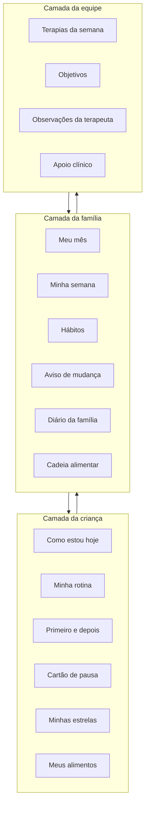
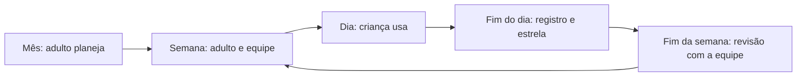

# Projeto "Meu Dia em Passos": planner visual para criança autista

**Modelo conceitual e executivo, versão 3.0**
Outubro de 2026. Documento de trabalho.

> **O que mudou em relação à versão 2.0**
>
> 1. Nova página **Mapa de preferências alimentares** (diário e semanal), baseada no template "Food Chaining – versão minimalista" da autora.
> 2. As páginas foram renumeradas de 0 a 16.
> 3. "Creche" passou a ser "escola" em todo o documento.
> 4. "Sobre mim" ganhou a estratégia "silêncio".
> 5. Terapias: a coluna agora é "Observações da terapeuta", e a tabela ganhou uma linha-modelo de preenchimento.
> 6. O hábito "Escovei o dente" foi incluído.
> 7. O diário da família ganhou um rodapé de apoio clínico: marcos do desenvolvimento, traços, sinais e sintomas, e dúvidas para a equipe.
> 8. Banco de cartões: entraram "parquinho", "tablet" (com uso orientado) e "evento social".
> 9. Nova seção 10, **Ecossistema de IA e repositório**, que liga o projeto ao repositório GitHub e aos arquivos de instruções para cada tipo de IA.

---

## 1. Identificação do projeto

| Item | Descrição |
|---|---|
| Título | Meu Dia em Passos: planner visual para criança autista |
| Produto | Planner físico (impresso e plastificado) com cartões móveis, mais uma versão digital (PDF interativo e página web que funciona sem internet) |
| Público principal | Criança autista de cerca de 3 anos, não leitora, sempre com mediação de um adulto |
| Públicos mediadores | Família, equipe terapêutica (ABA, fonoaudiologia, terapia ocupacional, psicologia, psicomotricidade e, se houver, nutrição) e escola |
| Prazo | Curto: protótipo em 5 semanas (ver o plano de sprints, versão 2.0) |
| Formato | A4 para parede ou mesa; A5 para mochila e terapia |
| Identidade | Símbolo do infinito colorido (neurodiversidade) e paleta suave |
| Repositório | `meu-dia-em-passos/` (GitHub), com documentação, prompts e instruções para as IAs |

---

## 2. Situação-problema e justificativa

Crianças autistas pequenas costumam ter dificuldade com transições, imprevistos e a noção abstrata do tempo. Muitas vezes, também ainda não conseguem dizer com palavras como estão se sentindo. Enquanto isso, a rotina da família se divide entre várias terapias, a escola e a casa, e cada lugar guarda informações próprias.

A alimentação é uma frente importante. A seletividade alimentar é comum em crianças autistas e está associada à sensibilidade sensorial (CERMAK; CURTIN; BANDINI, 2010). Uma revisão sistemática recente indica que textura, aparência, apresentação, cor, sabor e cheiro estão entre os principais fatores que influenciam as escolhas alimentares dessas crianças (FOOD SELECTIVITY..., 2025). Registrar esses padrões de forma organizada ajuda a família e a equipe a planejar pequenos avanços, sem pressão.

Os suportes visuais estão entre as práticas baseadas em evidências para autismo (STEINBRENNER et al., 2020). O ensino estruturado organiza o tempo, o espaço e a sequência das atividades (FONSECA; CIOLA, 2016). Já ambientes visualmente carregados podem prejudicar a atenção de crianças pequenas (FISHER; GODWIN; SELTMAN, 2014).

O projeto propõe um planner que:

1. Seja usado **pela** criança, e não apenas **sobre** ela.
2. Funcione como ponte entre a casa, as terapias e a escola.
3. Respeite o perfil sensorial da criança, inclusive na alimentação, e use o interesse restrito como motivação.

---

## 3. Objetivos

### Objetivo geral

Desenvolver um planner visual, previsível e de baixa carga sensorial que apoie a rotina, as transições, a expressão emocional, a alimentação e o acompanhamento terapêutico de uma criança autista de cerca de 3 anos.

### Objetivos específicos

1. Antecipar a rotina diária e semanal com pictogramas e cartões móveis.
2. Facilitar as transições com o quadro "primeiro, depois" e com o aviso de mudança.
3. Oferecer formas não verbais de expressar emoções e de pedir pausa.
4. Reunir em um só lugar o registro das terapias, das conquistas e das observações para a equipe clínica.
5. Acompanhar hábitos básicos sem cobrança.
6. Mapear as preferências alimentares e registrar uma cadeia alimentar gradual, sempre sem pressão e com orientação profissional.
7. Testar o protótipo com a família e a equipe e ajustá-lo a partir do uso real.

---

## 4. Personas e papéis

| Persona | Necessidades | Papel no planner |
|---|---|---|
| Criança (cerca de 3 anos) | Previsibilidade, imagens concretas, poucos elementos, tocar e mover | Move cartões, escolhe a carinha, cola estrelas, aponta alimentos |
| Família | Organizar a semana, entender as terapias, ter registro simples | Monta a rotina, faz a mediação e preenche os registros e o mapa alimentar |
| Equipe terapêutica | Comunicação com a família e continuidade das ações em casa | Escreve observações e metas e responde às dúvidas clínicas |
| Escola | Conhecer a rotina e o que acalma a criança | Consulta "Sobre mim" e o cartão de pausa |
| Profissional da alimentação (nutrição, fono ou TO) | Dados sobre aceitação e padrões sensoriais | Orienta a cadeia alimentar a partir do mapa |

---

## 5. Análise dos modelos de referência

| Modelo | O que aproveitar | Adaptação |
|---|---|---|
| Rastreador de hábitos (31 dias) | Acompanhamento diário | Grade semanal com pictogramas; 6 hábitos adequados à idade |
| Meu mês | Visão mensal e lembretes | Página do adulto com legenda de cores e campo para mudanças na rotina |
| Minha semana | Organização por dia | Versão com cartões para a criança e versão em lista para o adulto |
| Planner semanal de aprendizagem | Check-in emocional e registro de facilidades e dificuldades | 3 carinhas; diário da família escrito em linguagem positiva |
| Meu planner da terapia | Terapias por dia, metas, conquistas e observações | Menos poluição visual, sem peças de quebra-cabeça, campo para a habilidade trabalhada |
| Símbolo do infinito | Identidade da neurodiversidade | Marca discreta na capa e no rodapé |
| **Mapa de preferências alimentares (Notion, da autora)** | Alimentos aceitos por sabor, textura e visual; cadeia alimentar de um alimento-base até um alimento-alvo; progressão em 6 semanas; padrões encontrados | Dividido em uma página da criança ("Meus alimentos") e uma página do adulto ("Cadeia alimentar"), com legenda visual e registro diário e semanal |

---

## 6. Modelo conceitual

### 6.1 Arquitetura em três camadas



### 6.2 Fluxo temporal



### 6.3 Princípios de design pedagógico

1. Previsibilidade: mesma ordem, mesmo lugar e mesmos símbolos.
2. Concretude: foto real ou pictograma sempre junto de uma palavra curta.
3. Poucos elementos: no máximo 5 opções de escolha em cada página da criança.
4. Manipulação: cartões com velcro e envelope "ACABOU".
5. Comunicação sem fala: carinhas, cartão de pausa e apontar.
6. Interesse como motivação: o tema favorito aparece em detalhes do planner.
7. Linguagem positiva: registrar o esforço e a ajuda dada, nunca falhas.
8. Alimentação sem pressão: oferecer não é obrigar; olhar e tocar o alimento já contam como avanço.
9. Flexibilidade: o planner se adapta à criança.

---

## 7. Especificação dos módulos

### 7.1 Estrutura de páginas (versão 3.0)

| Nº | Página | Camada | Origem | Frequência |
|---|---|---|---|---|
| 0 | Capa | Criança | Novo | Única |
| 1 | Sobre mim | Família e escola | Novo | Revisão mensal |
| 2 | Meu mês | Família | Modelo "Meu mês" | Mensal |
| 3 | Minha semana | Família | Modelo "Minha semana" | Semanal |
| 4 | Como estou hoje? | Criança | Planner de aprendizagem | Diária |
| 5 | Minha rotina do dia | Criança | v1.2 | Diária |
| 6 | Primeiro e depois | Criança | v1.2 | Quando precisar |
| 7 | Terapias da semana | Equipe e família | Planner da terapia | Semanal |
| 8 | Hábitos da semana | Família e criança | Rastreador de hábitos | Diária |
| **9** | **Mapa de preferências alimentares** (9A Meus alimentos · 9B Cadeia alimentar) | **Criança, família e equipe** | **Template Notion da autora** | **Diária (9A) e semanal (9B)** |
| 10 | Hoje vai ter uma mudança | Família e criança | v1.2 | Quando houver mudança |
| 11 | Meu cartão de pausa | Criança | v1.2 | Sempre disponível |
| 12 | Minhas estrelas da semana | Criança | v1.2 | Semanal |
| 13 | Diário da família e apoio clínico | Família e equipe | Planner de aprendizagem | Diária ou semanal |
| 14 | Meu tema favorito | Criança | v1.2 | Livre |
| 15 | Guia do adulto mediador | Família e equipe | v1.2 | Consulta |
| 16 | Banco de cartões | Todas | Novo | Reposição |

### 7.2 Detalhamento das páginas

#### Página 1. Sobre mim

| Campo | Exemplo |
|---|---|
| Eu gosto de | [figura] dinossauros, água, música |
| Me incomoda | [figura] barulho alto, etiqueta de roupa |
| Me acalma | [figura] abraço apertado, cantinho, massinha |
| Eu me comunico | [figura] apontando, levando pela mão, algumas palavras |
| Quando estou desregulado(a), me ajuda | Falar pouco, diminuir a luz, silêncio, oferecer meu objeto |

#### Página 4. Como estou hoje?

| 🟢 | 🟡 | 🔴 |
|---|---|---|
| Carinha feliz: "Bem" | Carinha neutra: "Mais ou menos" | Carinha triste: "Não estou bem" |

O que me ajuda: [cartão] abraço · [cartão] água · [cartão] cantinho calmo · [cartão] massinha · [cartão] respirar como balão

A escala tem três opções para os 3 anos e pode crescer até quatro zonas mais adiante (KUYPERS, 2011). As evidências específicas desse modelo para autistas ainda são limitadas (ASAT, s.d.).

#### Página 5. Minha rotina do dia

| Manhã | Tarde | Noite |
|---|---|---|
| [cartão] Acordar | [cartão] Almoçar | [cartão] Banho |
| [cartão] Café | [cartão] Terapia ou escola | [cartão] Jantar |
| [cartão] Escovar os dentes | [cartão] Brincar ou parquinho | [cartão] Dormir |

Quando a criança termina uma atividade, o cartão vai para o envelope "ACABOU".

#### Página 6. Primeiro e depois

| PRIMEIRO | DEPOIS |
|---|---|
| [cartão de tarefa] | [cartão de algo de que eu gosto] |

#### Página 7. Terapias da semana

| Dia | Terapia | Horário | Habilidade trabalhada | Como chegou → como saiu | Observações da terapeuta | Para fazer em casa |
|---|---|---|---|---|---|---|
| *Modelo* | [ABA / Fono / TO / Psicologia / Psicomotricidade] | 14h | [ex.: comunicação funcional] | 🟢🟡🔴 → 🟢🟡🔴 | | |
| Segunda | | | | | | |
| Terça | | | | | | |
| Quarta | | | | | | |
| Quinta | | | | | | |
| Sexta | | | | | | |

No rodapé: Objetivos da semana (até 3) · Super conquistas · Recado da família para a equipe.

#### Página 8. Hábitos da semana

| Hábito | Seg | Ter | Qua | Qui | Sex | Sáb | Dom |
|---|---|---|---|---|---|---|---|
| [figura] Dormi bem | | | | | | | |
| [figura] Escovei os dentes | | | | | | | |
| [figura] Comi | | | | | | | |
| [figura] Bebi água | | | | | | | |
| [figura] Brinquei | | | | | | | |
| [figura] Tomei banho | | | | | | | |

O adulto marca e a criança cola a estrela. Um dia em branco também está tudo bem.

#### Página 9. Mapa de preferências alimentares (nova)

Esta página adapta o template "Mapa de preferências alimentares – Food Chaining, versão minimalista", criado pela autora no Notion ([link](https://pamellabiotech.notion.site/MAPA-DE-PREFER-NCIAS-ALIMENTARES-2f106a06ea8280129577d4d0f07fcce9)). Ele se inspira na técnica de encadeamento alimentar (food chaining), que parte de um alimento que a criança já aceita e muda, aos poucos, uma característica de cada vez (visual, sabor ou textura) até chegar a um alimento novo (FRAKER et al., 2007).

**Pré-requisitos (impressos no topo das páginas 9A e 9B):** refeições em família · sem pressão · sem comidas alternativas · ambiente calmo.

##### 9A. Meus alimentos (camada da criança; uso diário)

| Hoje eu... | Café | Almoço | Lanche | Jantar |
|---|---|---|---|---|
| [figura] Comi meu alimento conhecido | ⭐ | ⭐ | ⭐ | ⭐ |
| [figura] Olhei o alimento novo | ⭐ | ⭐ | ⭐ | ⭐ |
| [figura] Toquei ou cheirei | ⭐ | ⭐ | ⭐ | ⭐ |
| [figura] Provei | ⭐ | ⭐ | ⭐ | ⭐ |

Na parte de baixo da página há uma faixa com espaços para colar as fotos dos alimentos aceitos ("Eu gosto de...").

A escada "olhar, tocar ou cheirar, provar" valoriza cada contato com o alimento novo. Olhar já conta como avanço, porque a exposição repetida tem valor mesmo quando a criança ainda não come o alimento.

##### 9B. Cadeia alimentar (camada da família e da equipe; uso semanal)

**Alimentos aceitos**

| Alimento | Marca | Sabor | Textura | Visual | Notas |
|---|---|---|---|---|---|
| | | | | | |

Legenda: **Sabor** doce · salgado · azedo · amargo · picante · neutro | **Textura** crocante · macia · seca · pegajosa · mastigável · dura · úmida

**Cadeia: de → para**

- Alimento-base (aceito): __________
- Alimento-alvo (novo): __________

| Semana | O que muda? (visual / sabor / textura) | Resultado (olhou / tocou / provou / aceitou) | Data |
|---|---|---|---|
| 1 | | | |
| 2 | | | |
| 3 | | | |
| 4 | | | |
| 5 | | | |
| 6 | | | |

Status: ☐ Conseguiu ☐ Em andamento ☐ Parar e recomeçar

**Padrões encontrados**
- Combinação ideal: textura ______ + sabor ______ + visual ______
- Molhos e acompanhamentos que ajudam: ______
- Rejeições claras: ______

**Apoio profissional:** nome · contato · data do próximo contato · perguntas para o profissional.

**Dicas rápidas:** pequenas mudanças trazem grandes resultados · a exposição repetida tem valor mesmo sem aceitação · paciência · comemore as pequenas vitórias.

> **Atenção:** o mapa ajuda a organizar observações e não substitui a avaliação profissional. Se houver perda de peso, engasgos frequentes, um repertório alimentar muito restrito ou sofrimento intenso nas refeições, procure a equipe de saúde antes de iniciar uma cadeia alimentar.

#### Página 10. Hoje vai ter uma mudança

- O que muda: [cartão com figura e palavra], por exemplo médico, viagem ou evento social.
- O que continua igual: [cartão]
- Posso levar: [cartão] meu objeto · [cartão] fone · [cartão] pausa

#### Página 13. Diário da família e apoio clínico

| Dia | O que foi fácil hoje | O que precisou de mais ajuda | O que funcionou |
|---|---|---|---|
| | | | |

**Rodapé de apoio clínico**

| Campo | Como preencher |
|---|---|
| Marco do desenvolvimento observado | Descreva o que a criança fez pela primeira vez (ex.: "falou 'água' para pedir") |
| Traços, sinais ou sintomas observados | Descreva o que aconteceu, quando, quanto durou e com que frequência, sem dar nomes de diagnóstico |
| Dúvidas para apoio ao manejo clínico e terapêutico | Perguntas para levar à equipe |

O rodapé registra **observações**, e não diagnósticos. As anotações são dados sensíveis de saúde e devem circular apenas entre a família e a equipe autorizada (BRASIL, 2018).

### 7.3 Banco de cartões

| Categoria | Cartões |
|---|---|
| Rotina | Acordar, café, escovar os dentes, vestir, escola, terapia, almoçar, soneca, brincar, parquinho, banho, jantar, dormir |
| Terapias | Fonoaudiologia, terapia ocupacional, psicologia, ABA, psicomotricidade |
| Regulação | Abraço, água, cantinho calmo, massinha, respirar, tablet, objeto de conforto |
| Comunicação | Pausa, ajuda, quero, não quero, acabou, mais |
| Recompensas | Itens do tema favorito da criança |
| Mudanças | Médico, viagem, visita, passeio, "surpresa", evento social |
| **Alimentação (novo)** | Fotos dos alimentos aceitos, "alimento novo", "olhar", "tocar", "cheirar", "provar", "não quero agora" |

> **Sobre o cartão "tablet":** a Sociedade Brasileira de Pediatria recomenda, para crianças de 2 a 5 anos, até uma hora de tela por dia e sempre com supervisão ([SBP](https://www.sbp.com.br/criancas-no-celular-saiba-o-tempo-ideal-para-cada-idade/)). A sugestão é usar o cartão com um tempo combinado e visível (por exemplo, um timer visual) e alternar com estratégias de regulação sem tela.

---

## 8. Diretrizes visuais e sensoriais

| Elemento | Diretriz |
|---|---|
| Fundo | Liso, branco ou creme (#FFF9F0), sem estampas nas páginas da criança |
| Cores dos dias | Seg lilás #CDB4DB · Ter verde-menta #B7E4C7 · Qua azul-céu #BDE0FE · Qui coral #F4A7A3 · Sex amarelo-manteiga #FFE5A0 · Fim de semana pêssego #FFD6BA |
| Cores das emoções | Verde #6BBF59 · amarelo #F2C14E · vermelho suave #E76F51, usadas somente para emoções |
| Tipografia | Títulos em fonte arredondada (Fredoka ou Baloo 2) com 28 pt ou mais; rótulos em Nunito com 18 pt ou mais |
| Imagens | Um único estilo de pictograma; fotos reais para alimentos e objetos da criança |
| Símbolo | Infinito colorido; sem peças de quebra-cabeça, porque elas evocam associações negativas (GERNSBACHER et al., 2018) |
| Material | Papel de 180 g ou mais, plastificação, velcro e cantos arredondados |

---

## 9. Acessibilidade, licenças e ética

1. **Pictogramas:** os do ARASAAC usam a licença CC BY-NC-SA, que permite uso sem fins lucrativos com citação (ARASAAC, s.d.). Para uma versão comercial, é preciso ter ilustrações próprias.
2. **Dados sensíveis (LGPD):** saúde, terapias, alimentação e observações clínicas de criança são dados sensíveis e devem ser tratados no melhor interesse dela, com consentimento do responsável (BRASIL, 2018). Esses dados reais **nunca** devem entrar em ferramentas de IA nem no repositório.
3. **Direitos:** o projeto segue a Política Nacional de Proteção dos Direitos da Pessoa com TEA (BRASIL, 2012).
4. **Limite do produto:** o planner apoia a organização e a comunicação e não substitui avaliação nem intervenção profissional.

---

## 10. Ecossistema de IA e repositório

### 10.1 Tipos de IA e papel de cada uma

| Tipo de IA | Exemplos | Papel no projeto | Arquivo de instruções |
|---|---|---|---|
| IA de design | Canva AI | Diagramar as páginas, os cartões e a capa | `prompts/canva-ai.md` |
| IA de imagem | Canva "Create an image", ChatGPT (imagem), Gemini, Ideogram | Mascote, capa e elementos decorativos (nunca pictogramas da rotina) | `prompts/ia-imagem.md` |
| IA de texto (assistente) | ChatGPT, Claude, Gemini, Perplexity | Roteiros, textos das páginas, revisão de linguagem, referências ABNT | `prompts/ia-texto.md` |
| IA de código (agente) | GitHub Copilot, Claude Code, OpenAI Codex, Gemini CLI, Cursor | Versão digital em HTML/CSS (impressão A4 e uso interativo sem internet) | `.github/copilot-instructions.md`, `AGENTS.md`, `CLAUDE.md`, `GEMINI.md`, `.cursor/rules/` |
| IA de documentos | Notion AI | Manter o mapa alimentar e as fichas de acompanhamento | `prompts/notion-ai.md` |

### 10.2 Estrutura do repositório

```text
meu-dia-em-passos/
├── README.md
├── github_instructions.md        ← guia mestre das instruções de IA
├── AGENTS.md                     ← agentes em geral (Codex, Copilot, Cursor, Cline...)
├── CLAUDE.md                     ← Claude Code
├── GEMINI.md                     ← Gemini CLI / Antigravity
├── .github/
│   ├── copilot-instructions.md   ← GitHub Copilot (todo o repositório)
│   └── instructions/
│       ├── paginas-crianca.instructions.md
│       ├── dados-sensiveis.instructions.md
│       └── documentacao.instructions.md
├── .cursor/rules/projeto.mdc     ← Cursor
├── docs/                         ← projeto e plano de sprints
├── prompts/                      ← prompts por tipo de IA
├── src/                          ← versão digital (HTML/CSS/JS)
└── assets/                       ← ícones e imagens licenciadas (sem fotos reais)
```

---

## 11. Plano executivo (resumo)

O detalhamento está em `docs/sprints-meu-dia-em-passos-v2.md`.

| Fase | Semanas | Entregável |
|---|---|---|
| Base: repositório, kit de marca e imersão | 1 | Repositório, Brand Kit, perfil da criança e mascote |
| Produção: páginas e mapa alimentar | 2 e 3 | Páginas 0 a 16 e banco de cartões |
| Versão digital | 3 | HTML para impressão A4 e uso interativo |
| Validação: piloto | 4 | Registros e devolutivas |
| Versão final | 5 | Planner 1.0 (PDF para impressão, PDF interativo e web) |

### Riscos e mitigação

| Risco | Mitigação |
|---|---|
| A criança rejeitar o planner | Introduzir uma página por vez, ligada ao tema favorito |
| Sobrecarga do adulto | Versão mínima com as páginas 5 e 6 |
| A equipe não preencher | Campos curtos e versão A5 |
| Pressão na alimentação | Pré-requisitos impressos, escada de exposição e orientação profissional |
| Vazamento de dados | Nenhum dado real em IA ou no repositório; arquivo `.gitignore` para a pasta de dados |
| Excesso visual | Checklist com no máximo 5 elementos por página |

---

## 12. Avaliação do protótipo

| Indicador | Como observar | Fonte |
|---|---|---|
| Uso | Dias de uso na semana | Família |
| Transições | Nota de 1 a 5, antes e depois | Família e terapeuta |
| Comunicação | Vezes em que usou o cartão de pausa ou as carinhas | Família |
| Alimentação | Novos contatos (olhou, tocou, provou) por semana | Família e profissional |
| Utilidade para a equipe | Páginas 7 e 13 preenchidas e úteis | Terapeutas |
| Carga do mediador | Minutos por dia (meta: menos de 10) | Família |

---

## 13. Guia rápido do adulto mediador

1. Apresente uma página por semana.
2. Use sempre a mesma ordem e o mesmo lugar.
3. Avise as mudanças com antecedência (página 10).
4. Comemore a tentativa, e não só o resultado.
5. Nunca use o planner como castigo.
6. Leve as páginas 7 e 13 às terapias.
7. Nas refeições: ofereça sem obrigar (página 9).
8. Revise o "Sobre mim" uma vez por mês.

---

## Referências

ARASAAC. Terms of use. Zaragoza: Gobierno de Aragón, [s.d.]. Disponível em: https://arasaac.org/terms-of-use. Acesso em: 4 out. 2026.

ASSOCIATION FOR SCIENCE IN AUTISM TREATMENT (ASAT). Is there science behind that? Zones of Regulation. [S. l.]: ASAT, [s.d.]. Disponível em: https://asatonline.org/for-parents/becoming-a-savvy-consumer/zones-of-regulation-is-there-science-behind-that/. Acesso em: 4 out. 2026.

BALCAÇAR, P. A. Mapa de preferências alimentares: Food Chaining – versão minimalista. Versão 2.0. [S. l.]: Notion, 2026. Disponível em: https://pamellabiotech.notion.site/MAPA-DE-PREFER-NCIAS-ALIMENTARES-2f106a06ea8280129577d4d0f07fcce9. Acesso em: 4 out. 2026.

BRASIL. Lei nº 12.764, de 27 de dezembro de 2012. Institui a Política Nacional de Proteção dos Direitos da Pessoa com Transtorno do Espectro Autista. Brasília, DF: Presidência da República, 2012. Disponível em: https://www.planalto.gov.br/ccivil_03/_ato2011-2014/2012/lei/l12764.htm. Acesso em: 4 out. 2026.

BRASIL. Lei nº 13.709, de 14 de agosto de 2018. Lei Geral de Proteção de Dados Pessoais (LGPD). Brasília, DF: Presidência da República, 2018. Disponível em: https://www.planalto.gov.br/ccivil_03/_ato2015-2018/2018/lei/l13709.htm. Acesso em: 4 out. 2026.

CERMAK, S. A.; CURTIN, C.; BANDINI, L. G. Food selectivity and sensory sensitivity in children with autism spectrum disorders. Journal of the American Dietetic Association, v. 110, n. 2, p. 238-246, 2010. DOI: 10.1016/j.jada.2009.10.032.

FISHER, A. V.; GODWIN, K. E.; SELTMAN, H. Visual environment, attention allocation, and learning in young children: when too much of a good thing may be bad. Psychological Science, v. 25, n. 7, p. 1362-1370, 2014. DOI: 10.1177/0956797614533801.

FONSECA, M. E. G.; CIOLA, J. C. B. Vejo e aprendo: fundamentos do Programa TEACCH. 2. ed. Ribeirão Preto: Booktoy, 2016.

FOOD selectivity and autism: a systematic review. [S. l.], 2025. Disponível em: https://pmc.ncbi.nlm.nih.gov/articles/PMC12304907/. Acesso em: 4 out. 2026.

FRAKER, C. et al. Food chaining: the proven 6-step plan to stop picky eating, solve feeding problems, and expand your child's diet. Cambridge: Da Capo Press, 2007.

GERNSBACHER, M. A. et al. Do puzzle pieces and autism puzzle piece logos evoke negative associations? Autism, v. 22, n. 2, p. 118-125, 2018. DOI: 10.1177/1362361317727125.

KUYPERS, L. M. The Zones of Regulation: a curriculum designed to foster self-regulation and emotional control. Santa Clara: Think Social Publishing, 2011.

SOCIEDADE BRASILEIRA DE PEDIATRIA (SBP). Crianças no celular: saiba o tempo ideal para cada idade. Rio de Janeiro: SBP, [s.d.]. Disponível em: https://www.sbp.com.br/criancas-no-celular-saiba-o-tempo-ideal-para-cada-idade/. Acesso em: 4 out. 2026.

STEINBRENNER, J. R. et al. Evidence-based practices for children, youth, and young adults with autism. Chapel Hill: The University of North Carolina at Chapel Hill, Frank Porter Graham Child Development Institute, National Clearinghouse on Autism Evidence and Practice Review Team, 2020. Disponível em: https://ncaep.fpg.unc.edu/wp-content/uploads/EBP-Report-2020_Accessible.pdf. Acesso em: 4 out. 2026.

> **Notas de conferência:** antes de usar este documento em trabalho acadêmico, confira (a) a autoria e o periódico da revisão sistemática de 2025 (PMC12304907), (b) a edição e a editora de Fraker et al. (2007) e (c) a paginação de Fisher, Godwin e Seltman (2014).
