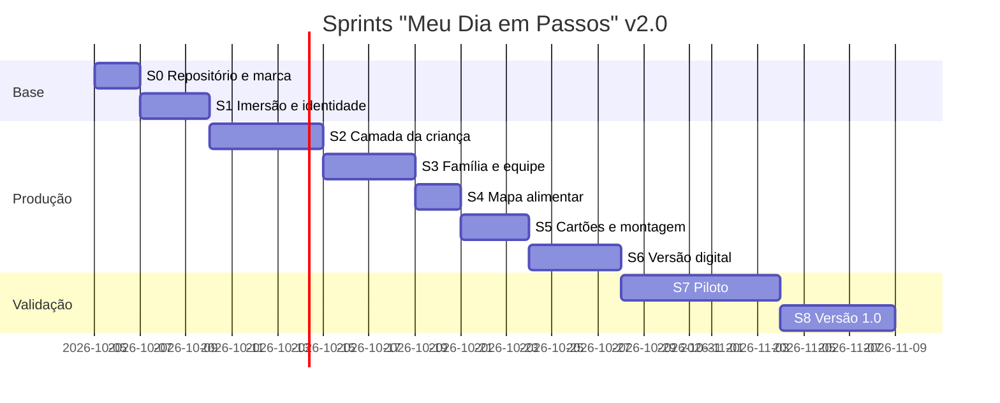

# Plano geral de Sprints: "Meu Dia em Passos"

**Versão 2.0.** Outubro de 2026. Complementa o documento "Projeto Meu Dia em Passos", versão 3.0.

> **O que mudou em relação à versão 1.0**
>
> 1. **De 7 para 9 sprints.** Entraram o S4 (Mapa de preferências alimentares) e o S6 (Versão digital com IA de código).
> 2. **Prompts para cada tipo de IA.** Agora há prompts para cinco tipos: Canva AI, IA de imagem, IA de texto, IA de código e Notion AI.
> 3. **Fluxo no GitHub.** Cada sprint vira uma *milestone*, cada tarefa vira uma *issue* e cada entrega fecha com um *commit* padronizado.
> 4. **Páginas renumeradas (0 a 16).** O plano acompanha o projeto 3.0 e já traz as mudanças de vocabulário: escola, parquinho, tablet e evento social.
> 5. **Prompts mais curtos.** Os prompts do Canva vêm em inglês, porque a IA do Canva ainda funciona melhor nesse idioma, e cada um traz um resumo em português. Os prompts das IAs de texto e de código estão em português.

---

## 1. Visão geral

| Item | Definição |
|---|---|
| Produto | Planner "Meu Dia em Passos" em três formatos: PDF para impressão, PDF interativo e versão web que funciona sem internet |
| Duração | 5 semanas (35 dias corridos), divididas em 9 sprints |
| Ritmo | Uma tarefa principal por dia, sempre adaptada à energia do dia (seção 8) |
| Equipe | Autora (produção), família (uso) e terapeuta ou profissional da alimentação (validação) |
| Repositório | `meu-dia-em-passos/`, no GitHub |

### Regras de ouro (valem para todas as IAs)

1. **Nenhum dado real da criança entra em IA ou no GitHub.** Nada de nome, foto, diagnóstico, terapias reais ou alimentação real. Use sempre dados fictícios, como "Criança A" ou "[NOME]".
2. **A IA entrega rascunho, e a autora revisa.** Todo resultado passa pelo checklist da seção 7.
3. **Pictogramas da rotina vêm de uma única fonte:** ARASAAC (CC BY-NC-SA) ou um único conjunto de ícones do Canva. A IA de imagem fica só para o mascote, a capa e a decoração.
4. **Sem peças de quebra-cabeça.** O símbolo do projeto é o infinito colorido.
5. **Linguagem positiva e sem pressão**, inclusive na alimentação.

---

## 2. Mapa dos sprints

| Sprint | Dias | Foco | IAs principais | Entregável |
|---|---|---|---|---|
| S0 | 1–2 | Base: repositório e kit de marca | IA de código, Canva AI | Repositório criado, instruções de IA, Brand Kit, template-mestre |
| S1 | 3–5 | Imersão e identidade | IA de texto, IA de imagem | Roteiro de imersão, perfil fictício, mascote |
| S2 | 6–10 | Camada da criança | Canva AI | Páginas 0, 4, 5, 6, 11, 12, 14 |
| S3 | 11–14 | Camadas da família e da equipe | Canva AI, IA de texto | Páginas 1, 2, 3, 7, 8, 10, 13, 15 |
| S4 | 15–16 | Mapa de preferências alimentares | Notion AI, Canva AI, IA de texto | Páginas 9A e 9B, cartões de alimentação |
| S5 | 17–19 | Banco de cartões e montagem | Canva AI | Página 16, envelope "ACABOU", PDF completo |
| S6 | 20–23 | Versão digital | IA de código | `src/` com HTML para impressão A4 e versão interativa |
| S7 | 24–30 | Piloto | IA de texto (análise) | Registros e devolutivas |
| S8 | 31–35 | Ajustes e versão 1.0 | Todas | Release `v1.0.0` com 3 formatos e lições aprendidas |



As datas podem mudar. Se a energia cair, prolongue o sprint e mantenha as pausas.

---

## 3. Fluxo de trabalho no GitHub

| Elemento | Convenção |
|---|---|
| Milestone | Uma por sprint: `S0 Base`, `S1 Imersão`, ... `S8 Versão 1.0` |
| Issue | Uma por página ou tarefa: `[P05] Minha rotina do dia` |
| Labels | `camada:crianca`, `camada:familia`, `camada:equipe`, `ia:canva`, `ia:imagem`, `ia:texto`, `ia:codigo`, `ia:notion`, `energia:baixa`, `energia:media`, `energia:hiperfoco` |
| Branch | `sprint-02/p05-rotina` |
| Commit | `feat(p05): layout da rotina do dia` · `docs(sprint): atualiza S2` · `fix(p07): cores dos dias` |
| Board | GitHub Projects com as colunas: Estacionamento → A fazer → Fazendo → Revisar (checklist) → Pronto |
| Release | `v0.1.0` (protótipo, fim do S5) · `v0.2.0` (digital, fim do S6) · `v1.0.0` (final, fim do S8) |

A label `energia:` ajuda a escolher a tarefa do dia de acordo com o seu estado.

---

## 4. Prompt-base universal

Estrutura que serve para qualquer IA:

```text
[PAPEL] Quem a IA deve ser
[CONTEXTO] Projeto "Meu Dia em Passos": planner visual para criança autista de ~3 anos, não leitora, com mediação adulta
[TAREFA] O que gerar
[FORMATO] Tamanho, orientação ou tipo de arquivo
[ESTRUTURA] Blocos na ordem
[TEXTOS] Textos exatos entre aspas, em português do Brasil
[ESTILO] Paleta, fontes, fundo, ícones
[RESTRIÇÕES] O que NÃO pode ter
```

Restrições fixas para as páginas da criança:

```text
Plain cream background (#FFF9F0), no patterns. Max 5 choice elements. No puzzle pieces.
Titles ≥ 28 pt, labels ≥ 18 pt. Soft desaturated colors. Lots of white space.
Simple thick-line icons in one consistent style. All text in Brazilian Portuguese.
```

---

## 5. Sprints detalhados

### S0. Base: repositório e kit de marca (dias 1 e 2)

**Objetivo:** preparar o repositório e o Canva para que tudo saia consistente.

**Tarefas**
- [ ] Criar o repositório `meu-dia-em-passos` (privado) e subir a estrutura com as instruções de IA (veja `github_instructions.md`).
- [ ] Criar as milestones de S0 a S8, as labels e o board.
- [ ] No Canva, criar a pasta do projeto e o Brand Kit (paleta, fontes e símbolo do infinito).
- [ ] Gerar o template-mestre A4.

**Paleta do Brand Kit**

| Uso | HEX |
|---|---|
| Fundo creme | #FFF9F0 |
| Texto grafite | #3A3A3A |
| Seg lilás · Ter verde-menta · Qua azul-céu | #CDB4DB · #B7E4C7 · #BDE0FE |
| Qui coral · Sex amarelo-manteiga · Fim de semana pêssego | #F4A7A3 · #FFE5A0 · #FFD6BA |
| Emoções: bem · mais ou menos · não estou bem | #6BBF59 · #F2C14E · #E76F51 |

**Fontes:** Fredoka ou Baloo 2 nos títulos; Nunito nos textos.

**Prompt S0.1 (IA de código): estrutura do repositório**
```text
Você é um assistente de engenharia trabalhando no repositório "meu-dia-em-passos".
Leia AGENTS.md antes de começar.
Tarefa: criar a estrutura de pastas docs/, prompts/, src/, assets/icons/, assets/mascote/ e data/ (esta última no .gitignore),
um README.md em português do Brasil explicando o projeto em até 15 linhas,
e um .gitignore que ignore data/, *.local.*, fotos (*.jpg, *.jpeg, *.heic) dentro de assets/ exceto assets/mascote/.
Não crie nenhum dado de criança. Ao final, liste os arquivos criados.
```

**Prompt S0.2 (Canva AI): template-mestre**

Em português: página A4 vertical com cabeçalho, o símbolo do infinito e um rodapé.

```text
Create an A4 portrait page template for a children's planner called "Meu Dia em Passos".
Simple header with space for the page title on the left and a small rainbow infinity symbol on the right.
Large empty central content area. Thin footer with the text "Meu Dia em Passos" and a page number placeholder.
Plain cream background (#FFF9F0), charcoal text (#3A3A3A), rounded font for titles.
Calm, minimalist, lots of white space. No patterns, no puzzle pieces. All text in Brazilian Portuguese.
```

**Pronto quando:** o repositório estiver no ar com as instruções de IA, o Brand Kit estiver salvo e o template-mestre estiver aprovado.
**Commit:** `chore(s0): estrutura do repositório e instruções de IA`

---

### S1. Imersão e identidade (dias 3 a 5)

**Objetivo:** conhecer a rotina real da criança fora do computador e definir o mascote.

**Tarefas**
- [ ] Gerar o roteiro de imersão e conversar com a família. As respostas ficam no papel ou em `data/`, fora do Git.
- [ ] Criar um **perfil fictício** para usar com as IAs.
- [ ] Escolher o tema favorito e o mascote.
- [ ] Definir a fonte dos pictogramas.

**Prompt S1.1 (IA de texto): roteiro de imersão**
```text
Você é uma neuropsicopedagoga experiente em autismo na primeira infância.
Escreva, em português do Brasil, um roteiro de conversa acolhedor com a família de uma criança autista de 3 anos, não leitora, para montar um planner visual.
Seções: rotina de um dia típico (manhã, tarde, noite); agenda semanal de terapias; escola; interesses favoritos; incômodos sensoriais (sons, luzes, texturas); o que acalma (incluindo silêncio); como se comunica; como reage a mudanças e a eventos sociais; alimentos que aceita e recusa; uso de tablet.
Até 18 perguntas, curtas, algumas objetivas de multiplas escolhas e outras abertas, sem jargão clínico. Termine com uma frase de agradecimento.
```

**Prompt S1.2 (IA de texto): perfil fictício**
```text
Crie um perfil FICTÍCIO de "Criança A", 3 anos, autista nível 1 de suporte, não leitora, para testar um planner visual.
Inclua: rotina de manhã/tarde/noite, 3 terapias semanais com dias, escola meio período, tema favorito [TEMA], 3 incômodos sensoriais, 4 estratégias que acalmam, forma de comunicação, 6 alimentos aceitos e 3 recusados.
Formato: tabela Markdown. Deixe claro no título que é um perfil fictício para testes.
```

**Prompt S1.3 (IA de imagem): mascote**
```text
Cute children's mascot illustration: a [MINT GREEN DINOSAUR / CHOSEN THEME], full body, gentle smile, neutral friendly pose.
Simple flat style, thick rounded outlines, few soft desaturated colors, no strong shadows.
Plain white background. No text. No excessive detail.
```

**Prompt S1.4 (IA de imagem): variações do mascote**
```text
Using the same mascot from the reference image, generate 6 variations in the same style:
1) waving hello; 2) holding a star; 3) sitting calmly with eyes closed (break); 4) pointing to the side (next);
5) sitting at a table looking curiously at a plate of food; 6) waving goodbye.
Same colors, same line thickness, plain white background, no text.
```

**Pronto quando:** o perfil fictício estiver em `docs/perfil-ficticio.md`, o mascote e as 6 variações estiverem em `assets/mascote/` e o tema estiver definido.
**Commit:** `feat(s1): perfil fictício e mascote`

---

### S2. Camada da criança (dias 6 a 10)

**Páginas:** 0 Capa · 4 Como estou hoje? · 5 Rotina · 6 Primeiro e depois · 11 Cartão de pausa · 12 Estrelas · 14 Tema favorito.

**P00. Capa.** Título, espaço para a foto, mascote e símbolo do infinito.
```text
A4 portrait cover for a children's planner. Large centered title: "Meu Dia em Passos".
Below, a large empty circle for a photo and a line "Meu nome é: ________".
[THEME] mascot at the bottom corner, small rainbow infinity symbol at the top corner.
Cream background with only a few soft [THEME] elements on the edges. Rounded font, cheerful but calm. No puzzle pieces.
All text in Brazilian Portuguese.
```

**P04. Como estou hoje?** Três carinhas e cinco espaços para os cartões de regulação.
```text
A4 portrait page for a 3-year-old non-reading autistic child. Title: "Como estou hoje?".
Three large circles side by side with a simple face and one word below:
green (#6BBF59) happy "Bem"; yellow (#F2C14E) neutral "Mais ou menos"; soft red (#E76F51) sad "Não estou bem".
Below, heading "O que me ajuda:" and a row of 5 empty rounded squares for velcro cards.
Plain cream background, lots of spacing, large rounded font. No patterns. All text in Brazilian Portuguese.
```

**P05. Minha rotina do dia.** Três colunas com quatro espaços cada e o envelope "ACABOU".
```text
A4 portrait visual routine page for a 3-year-old autistic child. Title: "Minha rotina do dia".
Three columns with header and icon: "Manhã" (sunrise), "Tarde" (sun), "Noite" (moon).
Each column: 4 large empty rounded dashed squares stacked vertically for velcro cards.
Bottom: a rectangle labeled "ACABOU" with a box icon.
Plain cream background, soft header colors, large font. No patterns. All text in Brazilian Portuguese.
```

**P06. Primeiro e depois.** Dois quadrados ligados por uma seta.
```text
A4 landscape page, extremely simple. Two large squares side by side separated by a thick right arrow.
Left titled "PRIMEIRO" (#BDE0FE). Right titled "DEPOIS" (#B7E4C7). Inside each, one large dashed card space.
Plain white background, very large rounded font. No other elements. All text in Brazilian Portuguese.
```

**P11. Cartão de pausa.** Quatro cartões para recortar.
```text
A4 sheet with 4 identical cut-out cards (10 x 7 cm) with dashed cut lines.
Each card: the [THEME] mascot sitting calmly with eyes closed, an open-hand icon, and large text "Eu preciso de uma pausa".
Soft lilac (#CDB4DB) card background, rounded corners, charcoal text. All text in Brazilian Portuguese.
```

**P12. Minhas estrelas da semana.** Sete dias, cada um com uma estrela.
```text
A4 landscape page. Title: "Minhas estrelas da semana", mascot holding a star.
Seven columns "Seg" "Ter" "Qua" "Qui" "Sex" "Sáb" "Dom", headers in day colors (lilac, mint, sky blue, coral, butter yellow, peach, peach).
Under each day, a large empty star outline. Footer: "Cada tentativa vale uma estrela".
Plain cream background, no patterns. All text in Brazilian Portuguese.
```

**P14. Meu tema favorito.** Uma moldura grande e livre.
```text
A4 portrait page. Title: "Meu tema favorito: [THEME]".
Large empty rounded frame covering 70% of the page for drawing or sticking pictures. A few small soft [THEME] illustrations only in the corners.
Cream background. All text in Brazilian Portuguese.
```

**Pronto quando:** as 7 páginas passarem no checklist da seção 7 e estiverem exportadas em PNG para `assets/paginas/`.
**Commit:** `feat(s2): camada da criança (P00, P04, P05, P06, P11, P12, P14)`

---

### S3. Camadas da família e da equipe (dias 11 a 14)

**Páginas:** 1 Sobre mim · 2 Meu mês · 3 Minha semana · 7 Terapias · 8 Hábitos · 10 Mudança · 13 Diário e apoio clínico · 15 Guia do mediador.

**P01. Sobre mim.** Cinco blocos de informação, incluindo "silêncio".
```text
A4 portrait "about me" profile page of an autistic child for family, school and therapists. Title: "Sobre mim".
Circular photo space at the top. Five rounded card blocks with icon and writing lines:
"Eu gosto de" (heart), "Me incomoda" (ear), "Me acalma" (cloud), "Eu me comunico" (speech bubble),
"Quando estou desregulado(a), me ajuda" (helping hand) with the hint text "falar pouco · diminuir a luz · silêncio · meu objeto".
Cream background, different soft color per block, readable font. No patterns. All text in Brazilian Portuguese.
```

**P02. Meu mês.** Calendário mensal com legenda de cores, incluindo "evento social".
```text
A4 portrait monthly calendar for the adult. Title: "Meu mês", field "Mês: ______".
7-column grid (Dom to Sáb), 5 rows. Above: boxes "Não esquecer" and "Mudanças na rotina".
Below: color legend lilac "Terapia", sky blue "Consulta", yellow "Evento social", coral "Mudança".
Cream background, thin light-gray lines, small mascot in the corner. All text in Brazilian Portuguese.
```

**P03. Minha semana.** Sete blocos coloridos e um lembrete.
```text
A4 portrait weekly planning page. Title: "Minha semana", field "Semana de ___ a ___".
Seven blocks with a day-color band (Segunda lilac, Terça mint, Quarta sky blue, Quinta coral, Sexta butter yellow, Sábado and Domingo peach), each with 4 checkbox lines.
Final "Lembrete" box with mascot. Two-column layout, cream background. All text in Brazilian Portuguese.
```

**P07. Terapias da semana.** Tabela com uma linha-modelo e a coluna "Observações da terapeuta".
```text
A4 landscape weekly therapy tracking page. Title: "Terapias da semana", fields "Mês", "Semana", "Ano".
Table columns: "Dia", "Terapia", "Horário", "Habilidade trabalhada", "Como chegou → como saiu" (3 small faces green/yellow/red twice), "Observações da terapeuta", "Para fazer em casa".
First row is a light-gray example row labeled "Modelo" with "ABA / Fono / TO / Psicologia / Psicomotricidade" and "ex.: comunicação funcional".
Then rows Segunda to Sexta with day-color bands.
Below, three boxes: "Objetivos da semana" (3 star lines), "Super conquistas" (medal), "Recado da família para a equipe".
Cream background, no puzzle pieces, small infinity symbol in the footer. All text in Brazilian Portuguese.
```

**P08. Hábitos da semana.** Seis hábitos, incluindo "Escovei os dentes".
```text
A4 landscape weekly habit tracker for a 3-year-old. Title: "Hábitos da semana".
6 rows with large icon and word: "Dormi bem" (moon), "Escovei os dentes" (toothbrush), "Comi" (plate), "Bebi água" (cup), "Brinquei" (ball), "Tomei banho" (drop).
7 columns "Seg" to "Dom" with large square sticker cells. Footer: "Dia em branco também está tudo bem."
Cream background, soft lines. All text in Brazilian Portuguese.
```

**P10. Hoje vai ter uma mudança.** Três blocos para antecipar a mudança.
```text
A4 portrait page to anticipate routine changes. Title: "Hoje vai ter uma mudança".
Three large stacked blocks with dashed card spaces: "O que muda" (curved arrow, coral), "O que continua igual" (check, mint), "Posso levar" (backpack, lilac) with 3 card spaces.
Small example icons under "O que muda": doctor, travel, visit, social event. Calm mascot in the footer. All text in Brazilian Portuguese.
```

**P13. Diário da família e apoio clínico.** Diário da semana com rodapé clínico.
```text
A4 portrait weekly family journal page. Title: "Diário da família".
Table with 7 rows (Segunda to Domingo, day-color band) and columns "O que foi fácil hoje", "O que precisou de mais ajuda", "O que funcionou".
Footer section titled "Apoio clínico" with three boxes:
"Marco do desenvolvimento observado", "Traços / sinais / sintomas observados (o quê, quando, quanto tempo)", "Dúvidas para apoio ao manejo clínico e terapêutico".
Small note at the bottom: "Registre observações, não diagnósticos. Compartilhe só com a equipe autorizada."
Cream background, readable font, clean look. All text in Brazilian Portuguese.
```

**P15. Guia do adulto mediador.** Oito passos.
```text
A4 portrait simple infographic. Title: "Guia do adulto mediador". 8 numbered steps with icons:
1 "Apresente uma página por semana"; 2 "Use sempre a mesma ordem e o mesmo lugar"; 3 "Avise mudanças antes (página 10)";
4 "Comemore a tentativa, não só o resultado"; 5 "Nunca use o planner como castigo"; 6 "Leve as páginas 7 e 13 às terapias";
7 "Nas refeições: ofereça sem obrigar (página 9)"; 8 "Revise o 'Sobre mim' todo mês".
Footer: "Este planner apoia, mas não substitui o acompanhamento profissional." Waving mascot, cream background. All text in Brazilian Portuguese.
```

**Prompt S3.1 (IA de texto): revisão de linguagem**
```text
Revise os textos abaixo de um planner para família de criança autista de 3 anos.
Critérios: português do Brasil; frases curtas; linguagem literal e positiva; sem jargão clínico; sem tom de cobrança ou culpa; sem termos capacitistas.
Devolva uma tabela com: texto original | problema | sugestão.
TEXTOS: [COLE AQUI]
```

**Pronto quando:** as 8 páginas estiverem prontas e com as cores dos dias iguais às da camada da criança.
**Commit:** `feat(s3): camadas da família e da equipe`

---

### S4. Mapa de preferências alimentares (dias 15 e 16)

**Objetivo:** adaptar o template do Notion ("Food Chaining – versão minimalista") em duas páginas do planner.

**Tarefas**
- [ ] Duplicar o template do Notion e manter o original intacto.
- [ ] Usar a Notion AI para gerar a versão simplificada e uma página de exemplo fictício.
- [ ] Diagramar a página 9A (criança) e a página 9B (adulto) no Canva.
- [ ] Criar os cartões de alimentação (alimento novo, olhar, tocar, cheirar, provar, "não quero agora").
- [ ] Pedir a validação de um profissional da alimentação, se possível.

**Prompt S4.1 (Notion AI): versão para o planner**
```text
Com base nesta página "Mapa de Preferências Alimentares – Food Chaining", crie uma versão resumida para impressão em duas partes:
Parte A "Meus alimentos" (uso diário pela criança com o adulto): grade com as refeições Café, Almoço, Lanche, Jantar e as linhas "Comi meu alimento conhecido", "Olhei o alimento novo", "Toquei ou cheirei", "Provei".
Parte B "Cadeia alimentar" (uso semanal pelo adulto): pré-requisitos, tabela de alimentos aceitos (Alimento, Marca, Sabor, Textura, Visual, Notas), De → Para, progressão de 6 semanas (O que muda, Resultado, Data), status, padrões descobertos e apoio profissional.
Mantenha as legendas de sabor e textura. Linguagem simples, sem pressão. Não invente dados.
```

**Prompt S4.2 (Notion AI): exemplo fictício**
```text
Preencha uma cópia desta página com um EXEMPLO FICTÍCIO de "Criança A", 3 anos, que aceita batata frita crocante de uma marca específica.
Alimento-alvo: palito de batata-doce assada. Mostre 6 semanas mudando uma característica por vez (visual, depois textura, depois sabor).
Marque no título "Exemplo fictício – não usar como orientação clínica".
```

**P09A. Meus alimentos (Canva AI).** Grade das refeições com a escada de exposição.
```text
A4 landscape page for a 3-year-old autistic child, used with an adult at meals. Title: "Meus alimentos".
Top strip with 4 small icons and text: "Refeição em família", "Sem pressão", "Ambiente calmo", "Sem comida alternativa".
Grid with 4 columns "Café", "Almoço", "Lanche", "Jantar" and 4 rows with icons:
"Comi meu alimento conhecido" (plate), "Olhei o alimento novo" (eye), "Toquei ou cheirei" (hand and nose), "Provei" (small spoon).
Each cell: an empty star outline. Bottom strip: "Eu gosto de..." with 6 empty rounded photo spaces.
Mascote looking curiously at a plate in the corner. Cream background, soft colors, no patterns. All text in Brazilian Portuguese.
```

**P09B. Cadeia alimentar (Canva AI).** Página técnica para o adulto.
```text
A4 portrait page for parents and feeding professionals. Title: "Cadeia alimentar".
Section 1 "Alimentos aceitos": table with columns "Alimento", "Marca", "Sabor", "Textura", "Visual", "Notas" (6 rows).
Under it, small legend: "Sabor: doce · salgado · azedo · amargo · picante · neutro" and "Textura: crocante · macia · seca · pegajosa · mastigável · dura · úmida".
Section 2 "De → Para": two boxes "Alimento-base (aceito)" and "Alimento-alvo (novo)" linked by an arrow.
Section 3 "Progressão": table with columns "Semana" (1 to 6), "O que muda? (visual / sabor / textura)", "Resultado (olhou / tocou / provou / aceitou)", "Data".
Status checkboxes: "Conseguiu", "Em andamento", "Parar e recomeçar".
Section 4 "Padrões descobertos": "Combinação ideal: textura + sabor + visual", "Molhos e acompanhamentos úteis", "Rejeições claras".
Footer: "Apoio profissional: nome · contato · próximo contato" and the tip "Pequenas mudanças = grandes resultados. Exposição repetida vale mesmo sem aceitação."
Clean, readable, cream background, soft peach accents. All text in Brazilian Portuguese.
```

**Prompt S4.3 (IA de texto): revisão técnica do mapa**
```text
Você é uma nutricionista com experiência em seletividade alimentar no autismo infantil.
Revise o conteúdo das páginas abaixo de um planner (Meus alimentos e Cadeia alimentar).
Aponte: termos que possam gerar pressão; lacunas de segurança (sinais de alerta para encaminhamento); clareza das legendas; coerência com a lógica de encadeamento alimentar (mudar uma característica por vez).
Não faça prescrição. Devolva em tópicos curtos.
CONTEÚDO: [COLE AQUI]
```

**Pronto quando:** as páginas 9A e 9B estiverem prontas, o exemplo fictício estiver em `docs/` e os cartões de alimentação estiverem criados.
**Commit:** `feat(s4): mapa de preferências alimentares (P09A, P09B)`

---

### S5. Banco de cartões e montagem (dias 17 a 19)

**Tarefas**
- [ ] Gerar uma folha de cartões para cada categoria.
- [ ] Inserir os pictogramas manualmente, no mesmo estilo.
- [ ] Fazer o envelope "ACABOU".
- [ ] Ordenar as páginas de 0 a 16, numerar e exportar o PDF para impressão com marcas de corte.
- [ ] Imprimir um teste.

**Prompt S5.1 (Canva AI): folha de cartões.** Repita para cada categoria.
```text
A4 portrait sheet with a 3 x 4 grid of identical cards (6 x 6 cm) with dashed cut lines.
Each card: empty square space in the center for a pictogram and one large word below.
Category: [CATEGORY]. Words: [WORDS]. Card border color: [COLOR]. Rounded corners, white background.
Sheet footer: "Cartões — [CATEGORY]". All text in Brazilian Portuguese.
```

| Categoria | Cor | Palavras |
|---|---|---|
| Rotina (folhas 1 e 2) | Azul-céu | Acordar, Café, Escovar os dentes, Vestir, Escola, Terapia, Almoçar, Soneca, Brincar, Parquinho, Banho, Jantar, Dormir |
| Terapias | Lilás | Fonoaudiologia, Terapia ocupacional, Psicologia, ABA, Psicomotricidade |
| Regulação | Verde-menta | Abraço, Água, Cantinho calmo, Massinha, Respirar, Tablet, Meu objeto |
| Comunicação | Amarelo-manteiga | Pausa, Ajuda, Quero, Não quero, Acabou, Mais |
| Recompensas | Pêssego | Itens do tema favorito |
| Mudanças | Coral | Médico, Viagem, Visita, Passeio, Surpresa, Evento social |
| Alimentação | Pêssego-claro | Alimento novo, Olhar, Tocar, Cheirar, Provar, Não quero agora |

**Prompt S5.2 (Canva AI): cartão "tablet" com tempo visível**
```text
Single card 6 x 6 cm: tablet icon, the word "Tablet" and below it a small visual timer with 4 segments labeled "15 min".
Mint border, rounded corners, white background. All text in Brazilian Portuguese.
```

**Prompt S5.3 (Canva AI): envelope "ACABOU"**
```text
Cut-and-fold envelope template on an A4 sheet with dashed fold lines and labeled glue tabs.
Front: large text "ACABOU", closed box icon, mascot waving goodbye. Short instructions "Recorte", "Dobre", "Cole".
Soft colors, white background. All text in Brazilian Portuguese.
```

**Pronto quando:** o PDF completo estiver exportado e impresso como teste, e a release `v0.1.0` estiver publicada.
**Commit:** `feat(s5): banco de cartões e montagem do PDF`

---

### S6. Versão digital com IA de código (dias 20 a 23)

**Objetivo:** criar uma versão web leve, sem servidor e sem coleta de dados, que sirva para (a) imprimir em A4 direto do navegador e (b) usar no tablet, arrastando os cartões.

**Requisitos técnicos**
- HTML, CSS e JavaScript puros, sem framework e sem dependências externas.
- CSS `@page` A4, com uma página por seção.
- Interação: arrastar e soltar cartões, além de tocar para marcar como concluído.
- Persistência opcional só em `localStorage`, com um botão "Apagar tudo".
- Acessibilidade: `alt` em todas as imagens, navegação por teclado, contraste AA e `prefers-reduced-motion`.
- Nenhuma chamada de rede, nenhum dado pessoal e nenhum rastreamento.

**Prompt S6.1 (IA de código): esqueleto**
```text
Leia AGENTS.md e .github/copilot-instructions.md.
Crie em src/ uma versão web do planner "Meu Dia em Passos":
- index.html com navegação simples entre as páginas P00 a P16 (uma <section> por página, id="p00"... "p16").
- styles.css com os tokens de cor e fonte de AGENTS.md, layout A4 em @media print (@page size A4; uma section por página; sem cabeçalhos do navegador).
- app.js vazio por enquanto.
Só HTML/CSS/JS puros, sem bibliotecas externas e sem chamadas de rede. Textos em português do Brasil.
Ao final, explique como abrir localmente e como imprimir em A4.
```

**Prompt S6.2 (IA de código): rotina com arrastar e soltar**
```text
Implemente a página P05 "Minha rotina do dia" em src/:
- três colunas Manhã/Tarde/Noite com 4 slots cada;
- um banco de cartões (dados fictícios em src/data/cartoes.json: id, rotulo, categoria, icone);
- arrastar e soltar com mouse e toque (Pointer Events), e alternativa por teclado (Enter para pegar/soltar);
- ao tocar duas vezes num cartão no slot, ele vai para a área "ACABOU" com animação suave (desligada se prefers-reduced-motion);
- estado salvo em localStorage com a chave "mdp-rotina" e botão "Apagar tudo".
Siga as regras de acessibilidade de AGENTS.md. Não use bibliotecas externas.
```

**Prompt S6.3 (IA de código): mapa alimentar digital**
```text
Implemente as páginas P09A e P09B em src/ seguindo docs/projeto-meu-dia-em-passos-v3.md (seção 7.2, Página 9):
- P09A: grade 4 refeições x 4 níveis (Comi conhecido, Olhei, Toquei/Cheirei, Provei); tocar na célula alterna uma estrela.
- P09B: tabela editável de alimentos aceitos com selects de Sabor e Textura (valores das legendas), bloco De → Para e progressão de 6 semanas com status.
- Exportar e importar o mapa em JSON local (download/upload pelo navegador), sem envio para servidor.
- Aviso fixo no topo de P09B: "Este registro não substitui orientação profissional."
Use apenas dados fictícios nos exemplos.
```

**Prompt S6.4 (IA de código): revisão de acessibilidade e privacidade**
```text
Revise todo o conteúdo de src/ e liste problemas em uma tabela (arquivo | linha | problema | correção), verificando:
contraste AA, alt em imagens, foco visível, navegação por teclado, tamanhos mínimos de fonte (títulos ≥ 28px, rótulos ≥ 18px),
prefers-reduced-motion, ausência de chamadas de rede, ausência de dados pessoais, ausência de peças de quebra-cabeça em ícones e textos.
Depois aplique as correções em um único commit.
```

**Pronto quando:** `src/index.html` abrir localmente, imprimir em A4 sem cortes e passar na revisão do S6.4, e a release `v0.2.0` estiver publicada.
**Commit:** `feat(s6): versão digital com rotina interativa e mapa alimentar`

---

### S7. Piloto (dias 24 a 30)

**Tarefas**
- [ ] Imprimir, plastificar e colar o velcro.
- [ ] Usar a versão mínima com a criança (páginas 4, 5, 6, 11 e 9A).
- [ ] Apresentar as páginas 7 e 13 à terapeuta e a 9B ao profissional da alimentação.
- [ ] Registrar os indicadores todos os dias, no papel ou em `data/`, fora do Git.
- [ ] Coletar as devolutivas.

**Prompt S7.1 (Canva AI): ficha de observação do piloto**
```text
A4 landscape daily observation sheet. Title: "Registro do piloto".
Table with 7 rows (days) and columns: "Usou o planner? (sim/não)", "Transições hoje (1 a 5)", "Cartão de pausa (vezes)",
"Novos contatos com alimento (olhou/tocou/provou)", "Mexeu nos cartões sozinho(a)?", "Tempo do adulto (min)", "Observações".
White background, light lines, readable font. All text in Brazilian Portuguese.
```

**Prompt S7.2 (IA de texto): questionário de devolutiva**
```text
Escreva um questionário curto em português do Brasil com três partes:
A) família (6 perguntas), B) terapeuta (5 perguntas), C) profissional da alimentação (4 perguntas),
sobre uma semana de uso de um planner visual com uma criança autista de 3 anos.
Avalie facilidade de uso, reação da criança, transições, clareza visual, utilidade das páginas de terapia e do mapa alimentar, e sugestões.
Misture escala de 1 a 5 com perguntas abertas. Linguagem simples e acolhedora.
```

**Prompt S7.3 (IA de texto): análise dos registros (com dados anonimizados)**
```text
Abaixo estão registros ANONIMIZADOS de 7 dias de piloto de um planner visual (sem nomes nem dados identificáveis).
Resuma em até 10 tópicos: padrões de uso, dias de maior e menor uso, relação entre uso e transições, evolução dos contatos com alimentos, tempo do adulto.
Depois liste 5 ajustes prioritários, separando "obrigatório" e "desejável". Não faça inferências clínicas.
DADOS: [COLE AQUI]
```

**Pronto quando:** houver 7 dias de registros e as devolutivas das três partes.

---

### S8. Ajustes e versão 1.0 (dias 31 a 35)

**Tarefas**
- [ ] Transformar os ajustes prioritários em issues.
- [ ] Aplicar as mudanças no Canva e em `src/`.
- [ ] Rodar o checklist da seção 7 em todas as páginas.
- [ ] Inserir a foto e o nome reais **manualmente**, só na cópia de uso da família, fora do Git.
- [ ] Exportar o PDF para impressão, o PDF interativo e a versão web.
- [ ] Gerar a versão sem dados pessoais para compartilhar.
- [ ] Publicar a release `v1.0.0` e preencher as lições aprendidas.

**Prompt S8.1 (Canva AI, com o design aberto): consistência**
```text
Review this design and apply: same font and size for all titles; consistent weekday colors on every page
(Monday lilac, Tuesday mint, Wednesday sky blue, Thursday coral, Friday butter yellow, weekend peach);
remove any background pattern from child-facing pages; increase spacing between blocks; ensure high text contrast.
Keep all text in Brazilian Portuguese.
```

**Prompt S8.2 (IA de código): notas da versão**
```text
Gere CHANGELOG.md no padrão Keep a Changelog, em português do Brasil, a partir do histórico de commits desde a tag v0.1.0,
agrupando em Adicionado, Alterado, Corrigido. Depois crie a tag v1.0.0 com a mensagem "Meu Dia em Passos 1.0".
```

**Prompt S8.3 (IA de texto): lições aprendidas**
```text
Crie um relatório curto de lições aprendidas, em português do Brasil, para o projeto "Meu Dia em Passos".
Seções: o que funcionou; o que não funcionou; o que mudou após o piloto; uso das IAs (o que ajudou, o que precisou de muita correção); próximos passos.
Tópicos curtos com espaço para preencher.
```

**Pronto quando:** a release `v1.0.0` estiver publicada com os três formatos e o relatório de lições aprendidas estiver em `docs/`.

---

## 6. Prompts de correção rápida

| Problema | IA | Prompt |
|---|---|---|
| Muitos elementos | Canva | "Simplify this design: keep only the title and main blocks, remove decorative elements, increase white space." |
| Peça de quebra-cabeça | Canva ou imagem | "Remove all puzzle pieces. Replace with a small rainbow infinity symbol." |
| Texto em inglês | Canva | "Translate all text in this design to Brazilian Portuguese, keeping the layout." |
| Cores fortes | Canva | "Change the palette to soft, desaturated pastel colors with a cream background." |
| Fonte pequena | Canva | "Increase all text sizes; titles at least 28 pt, labels at least 18 pt." |
| Mascote diferente | Imagem | "Use exactly the same mascot style as the reference image: same colors and line thickness." |
| Tom de cobrança | Texto | "Reescreva sem tom de cobrança ou culpa, com frases curtas e positivas." |
| Código com biblioteca externa | Código | "Remova todas as dependências externas e reescreva em HTML/CSS/JS puros, conforme AGENTS.md." |
| Dado real apareceu | Qualquer | Pare, apague o conteúdo e substitua por "[NOME]" ou "Criança A". Se o dado foi parar no Git, reescreva o histórico antes de enviar. |

---

## 7. Checklist de qualidade

Rode o checklist ao fim dos sprints S2, S3, S4, S5, S6 e S8.

**Páginas da criança**
- [ ] Fundo liso, sem estampas.
- [ ] No máximo 5 elementos de escolha.
- [ ] Títulos com 28 pt ou mais e rótulos com 18 pt ou mais.
- [ ] Um único estilo de pictograma.
- [ ] Cores das emoções usadas só para emoções.
- [ ] Nenhuma peça de quebra-cabeça.

**Todas as páginas**
- [ ] Cores dos dias consistentes.
- [ ] Português do Brasil revisado; uso de "escola", e não de "creche".
- [ ] Contraste suficiente; nenhum texto cortado ou sobreposto.
- [ ] Atribuição ao ARASAAC, se os pictogramas forem de lá.
- [ ] Nenhum dado real na versão compartilhada nem no Git.

**Mapa alimentar**
- [ ] Pré-requisitos visíveis no topo.
- [ ] Linguagem sem pressão.
- [ ] Aviso de que o mapa não substitui orientação profissional.

**Versão digital**
- [ ] Funciona sem internet e sem chamadas de rede.
- [ ] Impressão A4 sem cortes.
- [ ] Teclado, `alt` e `prefers-reduced-motion` funcionando.

---

## 8. Rituais de trabalho conforme a energia

| Energia | Tarefas sugeridas (label) |
|---|---|
| Baixa (1 e 2) | Revisar uma página, rodar o checklist ou organizar issues (`energia:baixa`) |
| Média (3) | Gerar uma página com prompt pronto e ajustar (`energia:media`) |
| Hiperfoco (4 e 5) | De 2 a 3 páginas ou uma tarefa de código, com alarme de pausa a cada 50 minutos e ideias extras na coluna "Estacionamento" (`energia:hiperfoco`) |
| Sobrecarga | Fechar tudo. O sprint espera |

**Ritual de entrada (3 minutos):** abrir o board, marcar a energia do dia e escolher uma issue com a label certa.

**Ritual de saída (3 minutos):** mover a issue de coluna, fazer o commit e escrever a próxima tarefa no comentário da issue.

---

## Referências

ARASAAC. Terms of use. Zaragoza: Gobierno de Aragón, [s.d.]. Disponível em: https://arasaac.org/terms-of-use. Acesso em: 4 out. 2026.

BALCAÇAR, P. A. Mapa de preferências alimentares: Food Chaining – versão minimalista. Versão 2.0. [S. l.]: Notion, 2026. Disponível em: https://pamellabiotech.notion.site/MAPA-DE-PREFER-NCIAS-ALIMENTARES-2f106a06ea8280129577d4d0f07fcce9. Acesso em: 4 out. 2026.

BRASIL. Lei nº 13.709, de 14 de agosto de 2018. Lei Geral de Proteção de Dados Pessoais (LGPD). Brasília, DF: Presidência da República, 2018. Disponível em: https://www.planalto.gov.br/ccivil_03/_ato2015-2018/2018/lei/l13709.htm. Acesso em: 4 out. 2026.

CANVA. Kickstart designs with Canva AI. Canva Help Center, [s.d.]. Disponível em: https://www.canva.com/help/using-canva-ai/. Acesso em: 4 out. 2026.

GITHUB. Adding repository custom instructions for GitHub Copilot. GitHub Docs, [s.d.]. Disponível em: https://docs.github.com/en/copilot/how-tos/copilot-on-github/customize-copilot/add-custom-instructions/add-repository-instructions. Acesso em: 4 out. 2026.

SOCIEDADE BRASILEIRA DE PEDIATRIA (SBP). Crianças no celular: saiba o tempo ideal para cada idade. Rio de Janeiro: SBP, [s.d.]. Disponível em: https://www.sbp.com.br/criancas-no-celular-saiba-o-tempo-ideal-para-cada-idade/. Acesso em: 4 out. 2026.

TECHCRUNCH. Canva's AI assistant can now call various tools to make designs for you. TechCrunch, 16 abr. 2026. Disponível em: https://techcrunch.com/2026/04/16/canvas-ai-assistant-can-now-call-various-tools-to-make-designs-for-you/. Acesso em: 4 out. 2026.
