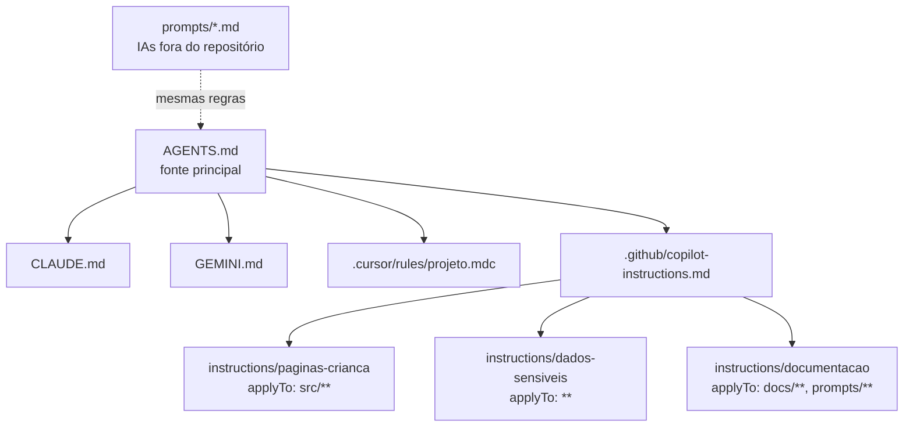

# github_instructions.md: guia mestre das instruções de IA

**Projeto:** Meu Dia em Passos · **Versão:** 1.0 · Outubro de 2026

Este guia explica quais arquivos de instruções existem no repositório, qual IA lê cada um e como configurá-los. Ao final, ele traz o conteúdo completo de cada arquivo, pronto para copiar.

---

## 1. Matriz: tipo de IA × arquivo de instruções

| Tipo de IA | Ferramenta | Onde ficam as instruções | Como ativar |
|---|---|---|---|
| Código (repositório) | GitHub Copilot | `.github/copilot-instructions.md` (todo o repositório) e `.github/instructions/*.instructions.md` (por caminho, com `applyTo`) | Automático no chat, no agente e no code review do repositório |
| Código (agente) | OpenAI Codex, Cline, Copilot agente | `AGENTS.md` | Automático: vale o `AGENTS.md` mais próximo da pasta em que o agente está |
| Código (agente) | Claude Code | `CLAUDE.md`, que importa `@AGENTS.md` | Automático ao abrir o repositório |
| Código (agente) | Gemini CLI / Antigravity | `GEMINI.md`, que importa `@AGENTS.md` | Automático ao abrir o repositório |
| Código (editor) | Cursor | `.cursor/rules/projeto.mdc` e `AGENTS.md` | Automático (`alwaysApply: true`) |
| Design | Canva AI | `prompts/canva-ai.md` (bloco de contexto e Brand Kit) | Manual: colar o bloco de contexto antes do prompt |
| Imagem | Canva "Create an image", ChatGPT, Gemini, Ideogram | `prompts/ia-imagem.md` | Manual ou como instrução personalizada |
| Texto | ChatGPT, Claude, Gemini, Perplexity | `prompts/ia-texto.md` | Colar no campo de instruções do Projeto, GPT, Gem ou Espaço |
| Documentos | Notion AI | `prompts/notion-ai.md` | Manual, com o template duplicado |

As convenções de arquivo do GitHub Copilot (instruções gerais, por caminho com `applyTo`, `AGENTS.md`, `CLAUDE.md` e `GEMINI.md`) seguem a [documentação do GitHub](https://docs.github.com/en/copilot/how-tos/copilot-on-github/customize-copilot/add-custom-instructions/add-repository-instructions). Os nomes de arquivo lidos por Codex, Cursor, Claude Code, Gemini CLI e Cline seguem o [levantamento da Digital Applied](https://www.digitalapplied.com/blog/coding-agent-instruction-files-which-tool-reads-what).

---

## 2. Hierarquia das regras



**Regra de manutenção:** para mudar uma regra geral, edite primeiro o `AGENTS.md` e depois replique o resumo nos demais arquivos. Faça isso num único commit: `docs(ia): atualiza regra X em todos os arquivos de instrução`.

---

## 3. Configuração passo a passo

1. Crie o repositório **privado** `meu-dia-em-passos` no GitHub.
2. Suba todos os arquivos desta pasta, incluindo `.github/`, `.cursor/` e o `.gitignore`.
3. Confira se `/data/` aparece como ignorada (`git status` não deve listá-la).
4. Crie as milestones de S0 a S8 e as labels descritas na seção 3 do plano de sprints.
5. No ChatGPT, Claude, Gemini ou Perplexity, crie um Projeto, GPT, Gem ou Espaço chamado "Meu Dia em Passos". Cole as instruções de `prompts/ia-texto.md` e anexe os dois documentos de `docs/`.
6. No Canva, crie o Brand Kit e salve o bloco de contexto de `prompts/canva-ai.md` num lugar fácil de copiar.
7. No Notion, duplique o template do mapa alimentar antes de usar a IA.

---

## 4. Regras comuns a todas as IAs

1. Nenhum dado real da criança.
2. Português do Brasil.
3. Nenhuma peça de quebra-cabeça.
4. Linguagem positiva, literal e sem pressão.
5. Nada de diagnóstico ou prescrição.
6. Baixa carga sensorial nas páginas da criança.
7. A IA entrega rascunho, e a autora revisa.

---

## 5. Conteúdo completo dos arquivos

### `AGENTS.md`

````markdown
# AGENTS.md: instruções para agentes de IA

Este arquivo é lido por agentes de código como OpenAI Codex, GitHub Copilot (modo agente), Cursor, Cline e Google Antigravity, e serve de base para `CLAUDE.md` e `GEMINI.md`.

## Projeto

"Meu Dia em Passos" é um planner visual para uma criança autista de cerca de 3 anos, não leitora, sempre usado com a mediação de um adulto. Ele organiza a rotina, as transições, as emoções, a alimentação e o acompanhamento terapêutico, com baixa carga sensorial.

- Especificação: `docs/projeto-meu-dia-em-passos-v3.md`, principalmente a seção 7.
- Plano de trabalho: `docs/sprints-meu-dia-em-passos-v2.md`.
- Público dos textos: famílias e terapeutas no Brasil. **Todo texto visível deve estar em português do Brasil.**

## Regras invioláveis

1. **Privacidade (LGPD):** nunca crie, peça, registre ou envie dados reais de criança, como nome, foto, diagnóstico, terapias, alimentação ou observações clínicas. Use apenas "Criança A" ou "[NOME]". A pasta `/data/` está no `.gitignore` e não deve ser lida nem versionada.
2. **Sem rede:** a versão digital não faz nenhuma chamada de rede. Isso exclui CDN, fontes remotas, analytics, rastreadores e APIs.
3. **Sem dependências:** use somente HTML, CSS e JavaScript puros. Sem frameworks, sem npm e sem bibliotecas externas.
4. **Sem peças de quebra-cabeça** em ícones, imagens ou textos. O símbolo do projeto é o infinito colorido.
5. **Linguagem positiva e literal:** sem cobrança, culpa ou termos capacitistas. Na alimentação, nada de pressão ("oferecer não é obrigar").
6. O planner **não substitui orientação profissional**. Nunca gere conteúdo de diagnóstico ou de prescrição.

## Estrutura

```text
docs/       especificação e plano (Markdown)
prompts/    prompts por tipo de IA
src/        versão digital: index.html, styles.css, app.js, data/cartoes.json (dados fictícios)
assets/     icons/ (pictogramas licenciados), mascote/, paginas/ (PNG exportados do Canva)
```

As páginas usam os ids `p00` a `p16`, seguindo a tabela 7.1 da especificação. A página 9 tem as subpáginas `p09a` (Meus alimentos) e `p09b` (Cadeia alimentar).

## Tokens de design

```css
:root {
  --fundo: #FFF9F0;   --texto: #3A3A3A;
  --seg: #CDB4DB;     --ter: #B7E4C7;   --qua: #BDE0FE;
  --qui: #F4A7A3;     --sex: #FFE5A0;   --fds: #FFD6BA;
  --emocao-bem: #6BBF59; --emocao-meio: #F2C14E; --emocao-mal: #E76F51;
  --fonte-titulo: "Fredoka", "Baloo 2", system-ui, sans-serif;
  --fonte-texto: "Nunito", system-ui, sans-serif;
}
```

As fontes devem ser arquivos locais em `assets/` ou cair no fallback do sistema. Nunca use Google Fonts remoto.

## Regras para as páginas da criança

As páginas da criança são `p00`, `p04`, `p05`, `p06`, `p09a`, `p11`, `p12` e `p14`.

- Fundo liso `--fundo`, sem estampas.
- No máximo 5 elementos de escolha por tela.
- Títulos com 28px ou mais e rótulos com 18px ou mais. Áreas de toque com pelo menos 48×48px.
- Cores das emoções usadas **somente** para emoções.
- Animações suaves e desligadas com `prefers-reduced-motion: reduce`.

## Acessibilidade

- HTML semântico, `alt` descritivo em todas as imagens e `aria-label` em botões com ícone.
- Navegação completa por teclado e foco visível.
- Contraste mínimo WCAG AA.
- Arrastar e soltar sempre com alternativa por teclado e por toque (Pointer Events).

## Impressão

- `@media print` com `@page { size: A4; margin: 10mm; }`.
- Uma `<section>` por página, com `break-after: page`.
- Esconder a navegação e os botões na impressão.

## Persistência

- Opcional, apenas em `localStorage`, com chaves prefixadas por `mdp-`.
- Sempre ter um botão "Apagar tudo".
- Exportar e importar em JSON somente pelo navegador (download e upload local).

## Commits e branches

- Commits: `feat(pXX): ...`, `fix(pXX): ...`, `docs(...): ...`, `chore(...): ...`.
- Branches: `sprint-NN/pXX-descricao`.
- Cada mudança de página referencia a issue `[PXX]`.

## Antes de concluir uma tarefa

- [ ] Nenhuma chamada de rede (`fetch`, `XMLHttpRequest`, `<link>` ou `<script>` externos).
- [ ] Nenhum dado pessoal real.
- [ ] Textos em português do Brasil.
- [ ] Checklist de acessibilidade ok.
- [ ] Impressão A4 testada (`Ctrl+P`).
- [ ] Resumo do que mudou e de como testar.
````

### `CLAUDE.md`

````markdown
# CLAUDE.md: instruções para o Claude Code

Leia e siga integralmente @AGENTS.md. As regras abaixo se somam às dele.

## Como trabalhar neste repositório

- Fale comigo em português do Brasil, de forma breve e clara. Sou uma pessoa neurodivergente: prefiro passos numerados, uma tarefa por vez e um resumo curto no fim.
- Antes de editar, mostre um plano de no máximo 5 passos e espere o meu "ok" quando a mudança afetar mais de 3 arquivos.
- Trabalhe na branch do sprint (`sprint-NN/pXX-descricao`) e faça commits pequenos com mensagens em português.
- Consulte `docs/projeto-meu-dia-em-passos-v3.md` (seção 7) para o conteúdo de cada página e `docs/sprints-meu-dia-em-passos-v2.md` (S6) para os requisitos da versão digital.

## Limites

- Não instale pacotes e não adicione dependências.
- Não leia `/data/`.
- Não faça chamadas de rede no código.
- Não gere textos clínicos, de diagnóstico ou de prescrição.

## Ao terminar

Diga em até 5 linhas o que mudou, como testar (abrir `src/index.html` e imprimir em A4) e qual é a próxima tarefa sugerida.
````

### `GEMINI.md`

````markdown
# GEMINI.md: instruções para o Gemini CLI e o Google Antigravity

Siga integralmente as regras de @AGENTS.md. Resumo do que é essencial:

## Contexto

O "Meu Dia em Passos" é um planner visual para uma criança autista de cerca de 3 anos, não leitora, com mediação de um adulto. A especificação está em `docs/projeto-meu-dia-em-passos-v3.md`.

## Regras

1. Escreva em português do Brasil.
2. Use HTML, CSS e JS puros, sem dependências e sem chamadas de rede.
3. Nunca use dados reais de criança; use "Criança A". Não leia `/data/`.
4. Use os tokens de cor e fonte de `AGENTS.md`. Fundo liso e no máximo 5 elementos nas páginas da criança.
5. Garanta acessibilidade (WCAG AA, teclado, `alt`, `prefers-reduced-motion`) e impressão A4.
6. Nada de peças de quebra-cabeça e nada de conteúdo clínico ou prescritivo.

## Estilo de interação

Mostre um plano curto antes de agir, execute uma tarefa por vez e termine com um resumo em até 5 linhas e a próxima tarefa sugerida.
````

### `.github/copilot-instructions.md`

````markdown
# Instruções do repositório para o GitHub Copilot

Projeto "Meu Dia em Passos": planner visual para uma criança autista de cerca de 3 anos, não leitora, sempre com mediação de um adulto. A especificação completa está em `docs/projeto-meu-dia-em-passos-v3.md` e as regras gerais de agente em `AGENTS.md`.

## Sempre

- Responda e escreva comentários, textos de interface e commits em **português do Brasil**.
- Use HTML, CSS e JavaScript puros, sem frameworks, sem npm e sem CDN.
- Use os tokens de cor e fonte definidos em `AGENTS.md`, sem inventar cores novas.
- Siga os ids de página `p00` a `p16`, com `p09a` e `p09b`.
- Garanta acessibilidade: `alt`, `aria-label`, teclado, foco visível, contraste AA e `prefers-reduced-motion`.
- Garanta a impressão A4 com `@page size A4` e uma `<section>` por página.

## Nunca

- Usar dados reais de criança (nome, foto, diagnóstico, terapias, alimentação). Use "Criança A" ou "[NOME]".
- Ler, criar ou sugerir arquivos em `/data/`.
- Fazer chamadas de rede, incluir analytics ou carregar fontes remotas.
- Usar peças de quebra-cabeça em ícones ou textos.
- Gerar conteúdo de diagnóstico ou prescrição, ou textos com tom de cobrança.

## Revisão de código (Copilot code review)

Ao revisar um pull request, verifique primeiro, nesta ordem:

1. Vazamento de dados pessoais.
2. Chamadas de rede.
3. Acessibilidade.
4. Regras das páginas da criança (no máximo 5 elementos, fontes mínimas, fundo liso).
5. Impressão A4.

## Mensagens de commit

`feat(p05): ...` · `fix(p07): ...` · `docs(sprint): ...` · `chore(s0): ...`
````

### `.github/instructions/paginas-crianca.instructions.md`

````markdown
---
applyTo: "src/**"
---

# Páginas da criança (src/)

Estas regras valem para as páginas `p00`, `p04`, `p05`, `p06`, `p09a`, `p11`, `p12` e `p14`.

- Fundo liso `var(--fundo)`, sem imagens de fundo nem estampas.
- No máximo 5 elementos de escolha visíveis por tela.
- Títulos com `font-size` de 28px ou mais; rótulos com 18px ou mais.
- Áreas de toque com pelo menos 48×48px e espaço de 16px ou mais entre elas.
- Pictogramas sempre de `assets/icons/`, com `alt` em português (ex.: `alt="Escovar os dentes"`).
- Cores `--emocao-*` usadas apenas nas carinhas de emoção.
- Toda animação dentro de `@media (prefers-reduced-motion: no-preference)`.
- Arrastar e soltar com Pointer Events e alternativa por teclado (Enter ou Espaço para pegar e soltar; setas para mover).
- Mensagens para o adulto curtas e positivas, sem cobrança.
````

### `.github/instructions/dados-sensiveis.instructions.md`

````markdown
---
applyTo: "**"
---

# Dados sensíveis (LGPD)

Dados de saúde, terapias, alimentação e observações clínicas de criança são dados pessoais sensíveis (Lei nº 13.709/2018).

- Nunca escreva nomes, datas de nascimento, fotos, diagnósticos, nomes de terapeutas, clínicas ou escolas reais.
- Exemplos e testes usam apenas "Criança A", "[NOME]" e `src/data/cartoes.json` com dados fictícios.
- A pasta `/data/` está fora do versionamento: não leia, não crie e não referencie arquivos nela.
- Nada de `fetch`, `XMLHttpRequest`, `navigator.sendBeacon`, WebSocket, analytics ou scripts e fontes externos.
- A persistência acontece apenas em `localStorage`, com prefixo `mdp-` e um botão "Apagar tudo".
- Se encontrar um dado que parece real, pare, avise e sugira substituí-lo por um marcador.
````

### `.github/instructions/documentacao.instructions.md`

````markdown
---
applyTo: "docs/**,prompts/**,*.md"
---

# Documentação e prompts

- Escreva em português do Brasil, com frases curtas e linguagem acessível.
- Use referências no padrão ABNT (NBR 6023), com URL e data de acesso.
- Mantenha a numeração de páginas `P00` a `P16`, com `P09A` e `P09B`, igual à especificação v3.0.
- Prompts para o Canva AI ficam em inglês e terminam com "All text in Brazilian Portuguese." Prompts para as demais IAs ficam em português.
- Cada prompt segue a estrutura do prompt-base: PAPEL, CONTEXTO, TAREFA, FORMATO, ESTRUTURA, TEXTOS, ESTILO e RESTRIÇÕES.
- Não use ênfase em itálico. Use **negrito** só para destaques.
- Não inclua dados reais de criança nem em exemplos.
````

### `.cursor/rules/projeto.mdc`

````markdown
---
description: Regras do projeto "Meu Dia em Passos" (planner visual para criança autista)
globs: ["src/**", "docs/**", "prompts/**"]
alwaysApply: true
---

# Regras do projeto para o Cursor

- Siga `AGENTS.md`, que é a fonte principal de regras.
- Escreva todo texto em português do Brasil.
- Use HTML, CSS e JS puros, sem dependências, sem CDN e sem chamadas de rede.
- Nunca use dados reais de criança; use "Criança A". Ignore `/data/`.
- Use os tokens de design de `AGENTS.md`. Páginas da criança com fundo liso, no máximo 5 elementos, títulos com 28px ou mais e rótulos com 18px ou mais.
- Garanta acessibilidade (WCAG AA, teclado, `alt`, `prefers-reduced-motion`) e impressão A4.
- Sem peças de quebra-cabeça e sem conteúdo clínico ou prescritivo.
- Commits: `feat(pXX): ...`, `fix(pXX): ...`.
````

### `prompts/canva-ai.md`

````markdown
# Canva AI: instruções e prompts

**Função no projeto:** diagramar páginas, cartões, capa e fichas.
**Onde usar:** Canva → Canva AI → "Design for me"; no editor, use o painel do Canva AI para ajustar o design aberto.

## Configuração (uma vez só)

1. Crie o Brand Kit "Meu Dia em Passos" com a paleta e as fontes de `AGENTS.md`.
2. Crie a pasta do projeto com as subpastas Criança, Família, Equipe, Alimentação, Cartões e Final.
3. Salve o template-mestre (prompt S0.2) e sempre parta dele.

## Bloco de contexto (cole no início de cada prompt)

```text
Context: children's visual planner "Meu Dia em Passos" for a 3-year-old non-reading autistic child, used with an adult.
Brand: cream background #FFF9F0, charcoal text #3A3A3A, soft desaturated pastels, rounded title font, rainbow infinity symbol.
Rules: no patterns on child pages, max 5 choice elements, titles ≥ 28 pt, labels ≥ 18 pt, no puzzle pieces, lots of white space.
All text in Brazilian Portuguese.
```

## Prompts deste projeto (em `docs/sprints-meu-dia-em-passos-v2.md`)

| ID | Página |
|---|---|
| S0.2 | Template-mestre |
| P00, P04, P05, P06, P11, P12, P14 | Camada da criança (S2) |
| P01, P02, P03, P07, P08, P10, P13, P15 | Camadas da família e da equipe (S3) |
| P09A, P09B | Mapa de preferências alimentares (S4) |
| S5.1, S5.2, S5.3 | Cartões, cartão "tablet" e envelope "ACABOU" |
| S7.1 | Ficha do piloto |
| S8.1 | Revisão de consistência |

## Cuidados

- Nunca envie fotos reais da criança ao Canva AI. Insira a foto à mão, só na cópia da família.
- Os pictogramas da rotina devem vir do ARASAAC ou de um único conjunto de ícones do Canva, nunca gerados por IA.
- Se o resultado sair em inglês, use: "Translate all text in this design to Brazilian Portuguese, keeping the layout."
````

### `prompts/ia-imagem.md`

````markdown
# IA de imagem: instruções e prompts

**Ferramentas possíveis:** Canva "Create an image", ChatGPT (geração de imagem), Gemini, Ideogram.
**Função no projeto:** criar o mascote e suas variações, a ilustração da capa e os elementos decorativos do tema.
**Não usar para:** os pictogramas da rotina, porque o estilo precisa ser único e acessível (ARASAAC), nem para fotos da criança.

## Instruções fixas (cole no início ou salve como instrução personalizada)

```text
You create illustrations for a calm children's planner for a 3-year-old autistic child.
Style: simple flat illustration, thick rounded outlines, few soft desaturated colors, no strong shadows, plain white or transparent background, no text inside the image.
Never draw puzzle pieces. Never depict a real child or a realistic child face.
Keep the same mascot design across all images when a reference image is given.
```

## Prompts deste projeto

| ID | Uso |
|---|---|
| S1.3 | Mascote base |
| S1.4 | 6 variações (oi, estrela, pausa, apontando, à mesa olhando o prato, tchau) |

## Consistência do mascote

1. Gere o mascote base e escolha uma versão.
2. Use sempre essa imagem como referência nas variações.
3. Se o estilo mudar, use: "Use exactly the same mascot style as the reference image: same colors and line thickness."
4. Salve os arquivos em `assets/mascote/` com nomes como `mascote-oi.png`, `mascote-pausa.png` etc.

## Licença

Antes de usar as imagens no material, verifique os termos de uso de cada ferramenta, principalmente se houver intenção comercial.
````

### `prompts/ia-texto.md`

````markdown
# IA de texto: instruções e prompts

**Ferramentas possíveis:** ChatGPT (Projetos ou GPT personalizado), Claude (Projetos), Gemini (Gems), Perplexity (Espaços).
**Função no projeto:** roteiros de imersão, perfil fictício, revisão de linguagem, questionários, análise de registros anonimizados, referências ABNT e lições aprendidas.

## Instruções personalizadas (cole no campo de instruções do projeto, GPT, Gem ou Espaço)

```text
Você apoia a autora do projeto "Meu Dia em Passos", um planner visual para uma criança autista de ~3 anos, não leitora, usado com mediação adulta.
A autora é neurodivergente: responda em português do Brasil, com frases curtas, passos numerados, uma tarefa por vez e um resumo final de até 5 linhas.
Ajuste o ritmo à energia informada (baixa, média, hiperfoco).
Regras:
- Nunca peça nem use dados reais da criança; trabalhe só com "Criança A" ou dados anonimizados.
- Linguagem positiva, literal, sem cobrança, sem termos capacitistas.
- Não faça diagnóstico nem prescrição; quando o tema for clínico ou alimentar, recomende o profissional.
- Referências no padrão ABNT (NBR 6023), com URL e data de acesso; não invente referências, e sinalize o que precisa ser conferido.
- Prefira saídas em Markdown (tabelas e listas curtas).
Arquivos de apoio: docs/projeto-meu-dia-em-passos-v3.md e docs/sprints-meu-dia-em-passos-v2.md.
```

## Prompts deste projeto

| ID | Uso |
|---|---|
| S1.1 | Roteiro de imersão com a família |
| S1.2 | Perfil fictício "Criança A" |
| S3.1 | Revisão de linguagem das páginas |
| S4.3 | Revisão técnica do mapa alimentar (papel: nutricionista) |
| S7.2 | Questionário de devolutiva |
| S7.3 | Análise dos registros anonimizados do piloto |
| S8.3 | Lições aprendidas |

## Prompt extra: referências ABNT

```text
Formate as referências abaixo no padrão ABNT NBR 6023, em ordem alfabética, com "Disponível em:" e "Acesso em:".
Não invente dados ausentes: use [s.d.], [S. l.] ou marque "conferir".
REFERÊNCIAS: [COLE AQUI]
```
````

### `prompts/notion-ai.md`

````markdown
# Notion AI: instruções e prompts

**Função no projeto:** manter o Mapa de preferências alimentares (template "Food Chaining – versão minimalista") e as fichas de acompanhamento em formato de base de dados.
**Template original:** [Mapa de preferências alimentares](https://pamellabiotech.notion.site/MAPA-DE-PREFER-NCIAS-ALIMENTARES-2f106a06ea8280129577d4d0f07fcce9)

## Boas práticas

1. **Duplique** o template antes de pedir qualquer mudança à IA e mantenha o original intacto.
2. A cópia com dados reais da família fica **privada** e não é publicada na web.
3. Para testes e exemplos, use apenas a "Criança A".

## Prompts deste projeto

| ID | Uso |
|---|---|
| S4.1 | Gerar a versão do planner (9A Meus alimentos e 9B Cadeia alimentar) |
| S4.2 | Preencher um exemplo fictício de 6 semanas |

## Prompt extra: transformar em base de dados

```text
Transforme a tabela "Alimentos aceitos" desta página em uma base de dados com as propriedades:
Alimento (título), Marca (texto), Sabor (seleção: Doce, Salgado, Azedo, Amargo, Picante, Neutro),
Textura (multisseleção: Crocante, Macia, Seca, Pegajosa, Mastigável, Dura, Úmida), Visual (texto), Notas (texto).
Crie também uma visualização em galeria agrupada por Textura.
```

## Prompt extra: resumo semanal

```text
Com base nos registros desta semana na tabela "Progressão", escreva um resumo de até 5 tópicos para levar ao profissional:
o que mudou, o resultado (olhou, tocou, provou, aceitou), padrões percebidos e 2 perguntas para o profissional.
Não faça recomendações clínicas.
```
````

### `prompts/ia-codigo.md`

````markdown
# IA de código: instruções e prompts

**Ferramentas possíveis e arquivo que cada uma lê:**

| Ferramenta | Arquivo de instruções |
|---|---|
| GitHub Copilot (chat, agente, code review) | `.github/copilot-instructions.md` + `.github/instructions/*.instructions.md` + `AGENTS.md` |
| OpenAI Codex | `AGENTS.md` |
| Claude Code | `CLAUDE.md` (importa `AGENTS.md`) |
| Gemini CLI / Google Antigravity | `GEMINI.md` (importa `AGENTS.md`) |
| Cursor | `.cursor/rules/projeto.mdc` + `AGENTS.md` |
| Cline | `AGENTS.md` |

**Função no projeto:** criar a versão digital em `src/` (HTML, CSS e JS puros), com impressão A4, cartões arrastáveis e mapa alimentar interativo; além de estrutura do repositório e notas de versão.

## Prompts deste projeto (em `docs/sprints-meu-dia-em-passos-v2.md`)

| ID | Uso |
|---|---|
| S0.1 | Estrutura do repositório e `.gitignore` |
| S6.1 | Esqueleto da versão digital e layout A4 |
| S6.2 | Rotina com arrastar e soltar (P05) |
| S6.3 | Mapa alimentar digital (P09A e P09B) |
| S6.4 | Revisão de acessibilidade e privacidade |
| S8.2 | CHANGELOG e tag `v1.0.0` |

## Prompt extra: página genérica

```text
Leia AGENTS.md. Implemente a página [PXX – NOME] em src/ seguindo docs/projeto-meu-dia-em-passos-v3.md, seção 7.2.
Use os tokens de design, respeite as regras das páginas da criança (se aplicável), garanta impressão A4 e acessibilidade.
Sem dependências e sem rede. Mostre um plano curto antes e um resumo de até 5 linhas depois.
```
````

---

## Referências

DIGITAL APPLIED. Which AI coding tools read which instruction file? [S. l.]: Digital Applied, 2026. Disponível em: https://www.digitalapplied.com/blog/coding-agent-instruction-files-which-tool-reads-what. Acesso em: 4 out. 2026.

GITHUB. Adding repository custom instructions for GitHub Copilot. GitHub Docs, [s.d.]. Disponível em: https://docs.github.com/en/copilot/how-tos/copilot-on-github/customize-copilot/add-custom-instructions/add-repository-instructions. Acesso em: 4 out. 2026.
